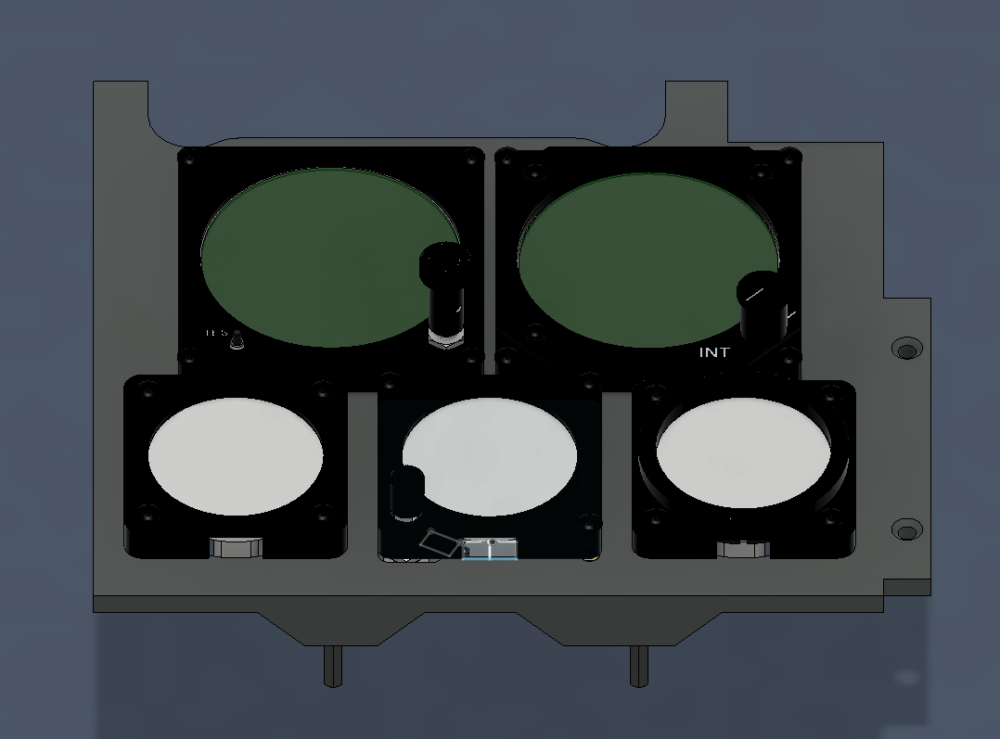

# ESP32 STANDBY INSTRUMENT MODULE
---
Title: ESP32 STANDBY INSTRUMENT MODULE
Authors: See credit
Pre-Release date: May, 2026
Derived from: v0.3.0
---

# Introduction
This mod replaces the specs gauges that are using a complex assemblage of stepper motors and precise needles with more economical (and way less cool) ESP32 driven screens. This is especially useful if you do not have access to the imperial components needed to build this part. It is organized around several ESP32-S3 driven screens that send data to an ESP32-S3 HUB, which itself is connected to the pit via USB and sending data to DCS-Bios via the COM port associated. The power is provided by the UART port of the screen boards, so no USB plug are required on the screens. 

The following screens from Waveshare are needed:
- [Waveshare ESP32-S3-LCD-1.85](https://www.waveshare.com/wiki/ESP32-S3-LCD-1.85)
- [Waveshare ESP32-S3-LCD-1.28](https://www.waveshare.com/wiki/ESP32-S3-LCD-1.28)
- [Waveshare ESP32-S3-LCD-2.8C](https://docs.waveshare.com/ESP32-S3-LCD-2.8C)

The following development board is needed for the HUB: 
- [Waveshare ESP32-S3 Zero board](https://www.waveshare.com/esp32-s3-zero.htm)

Note that all ESP32-S3 driven screens and the HUB could be replaced by any other ESP32-S3 powered hardware of similar specs. However, each constructor have their own board wiring and component footprint, which makes this kind of mod impossible to maintain on more than a specific set of hardware. We thus decided to develop this mod around Waveshare products and everything, software or mechanical mods, availablee for this mod are based on that. We strongly discourage builders to divers from these specs. Should they decide to, no support will be provided.

# How to build this mod
To build and have a working mod, you need two parts: the mechanical modification that you will find in that folder and the associated software for all ESP32-S3 boards that you will be able to get from [Ash's repository ESP32 STANDBY INSTRUMENT MODULE](https://github.com/ashchan/hornet-esp32-gauges). In this folder, we only mention how to build and wire the components. For how to deal with the software, please check the software repository.

The modifications puroposes are as following:
- Update the bezels for the gauge to allow for the screens (OH2A7A1-101, OH2A7A1-201 and OH2A7A1-301) to fit. Exists in two versions:
    - In the root folder, the bezel parts allow for a clean insertion of each screen
	- In the "debug parts" have a cut at the bottom of each bezel exposing the USB port from the screens, which allows for easy access to the USB port without having to disassemble the whole panel
- Adds new inserts on the SUBASSY, ANALOG RIGHT LOWER INSTRUMENT PANEL (OH2A7A1-10) to secure the screens (print the spec file)
- New pieces to print to secure the screens (OH2A7A1-MODA, more?)

All the moded pieces replace the original pieces as one to one. You are also expected to ignore many of the existing parts, as they are not used at all with ESP32 driven screens, namely:
- To be written

## Note for later
hub-s3: non specific S3 board
hub: dedicated to the Washare S3-Zero

# Assembly
**THIS IS WIP clearly not well explained**

- Add 4 additionals 6-32 inserts at the location highlighted in red. These are the same holes than the inserts on the other side.

- Add the new holder to keep the screen well in place. Do not tighten the screws too much, they should be just thigh enough to keep everything not moving

Additional thing: keep the original holder for the encoder in Altimeter (OH2A7A1-205)

Currently missing in that guide:
- Piece and assembly instructions to hold the ALE and the HUB
- Piece and assembly instructions  to hold the SARI

# Wiring
To be written

# FAQ
#### Where is the RWR mod?
This screen cannot be run on an ESP32 due to DCS not exporting all the necessary components to make it work. At this date the HDMI screen must be used.

#### What about the ESP32 IFEI?
Check the other mod for that!

# Credit
- Software part: see [Ash's repository](https://github.com/ashchan/hornet-esp32-gauges).
- 3D Models: Breith - build from the original implementation from Ash, Reaper021, Gnomi, RAFAIR Dave H (hopeefully I didn't forget anyone)
- Wiring: Ash, Reaper021

