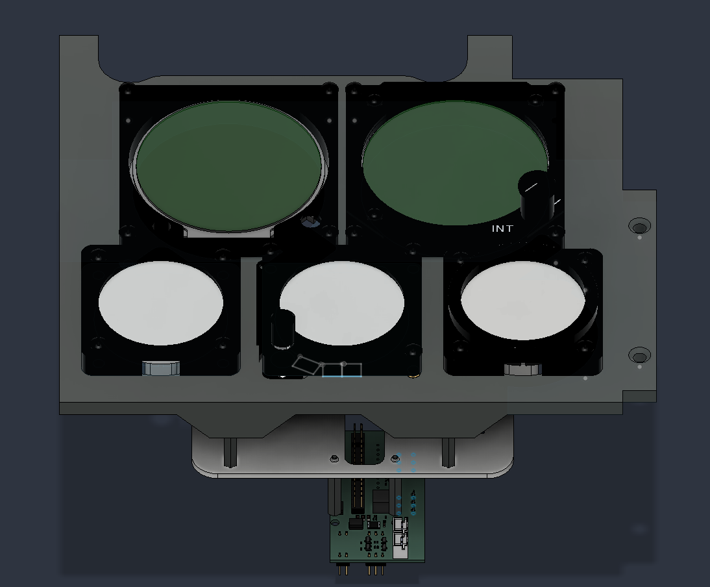
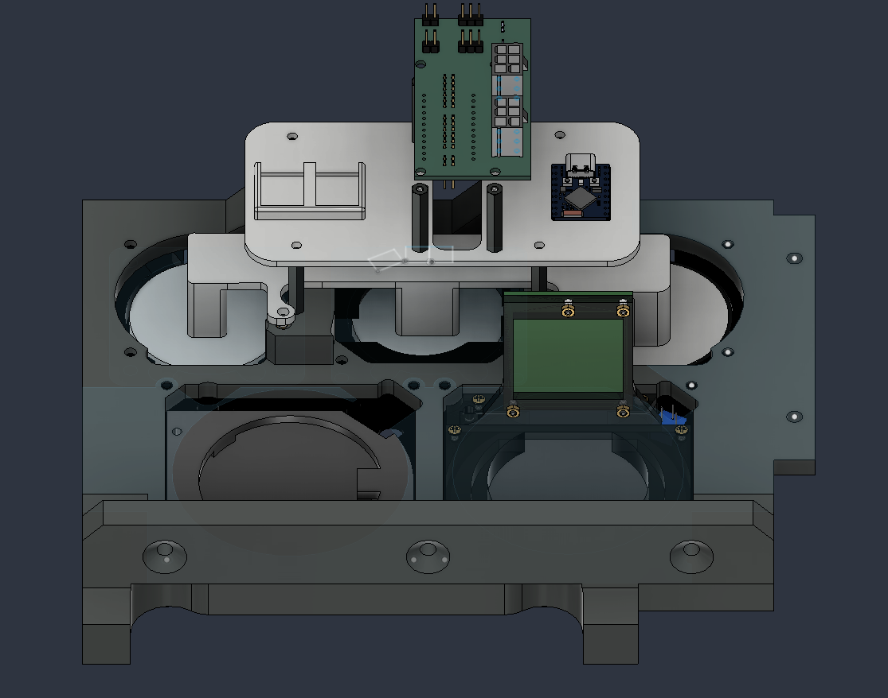
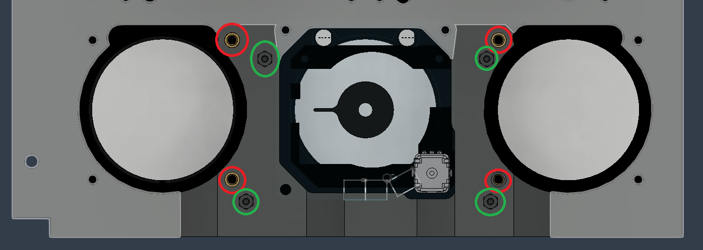
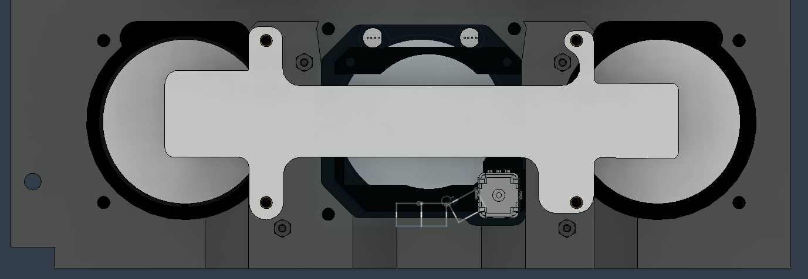
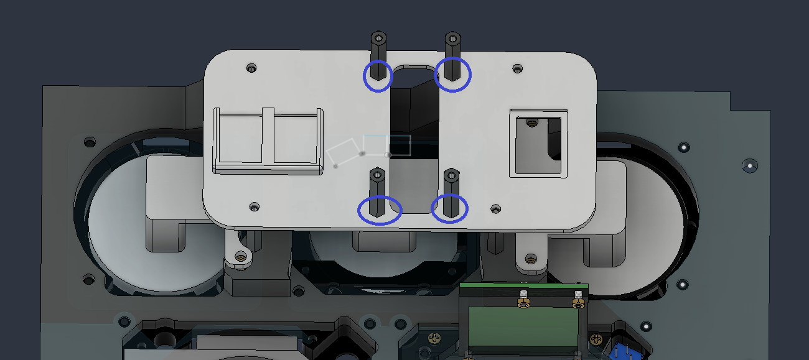
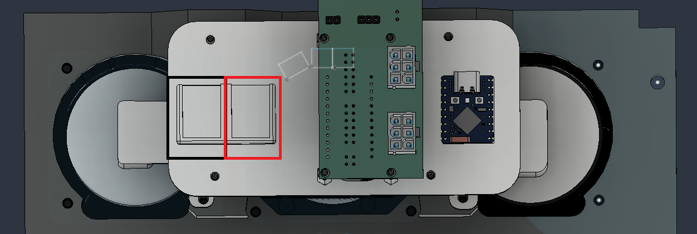
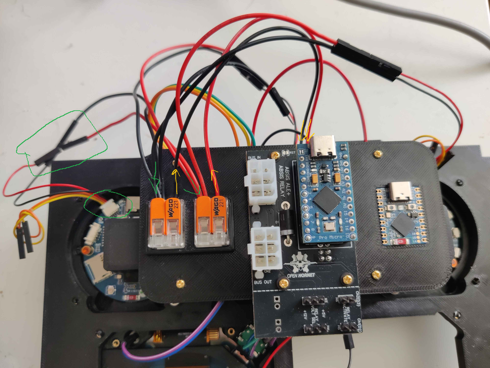

# ESP32 STANDBY INSTRUMENT MODULE
---
Title: ESP32 STANDBY INSTRUMENT MODULE
Authors: See credit
Pre-Release date: August, 2026
Derived from: v0.3.0
---

# Introduction
This mod replaces the specs gauges that are using a complex assemblage of stepper motors and precise needles with more economical (and way less cool) ESP32 driven screens. This is especially useful if you do not have access to the imperial components needed to build this part. It is organized around several ESP32-S3 driven screens that send data to an ESP32-S3 HUB, which itself is connected to the pit via USB and sending data to DCS-Bios via the COM port associated. The power is provided by the UART port of the screen boards, so no USB plug are required on the screens. The inputs (buttons/encoders) are managed by a regular ALE that has been reprogrammed to only contains the input management.

The following screens from Waveshare are needed:
- [Waveshare ESP32-S3-LCD-1.85](https://www.waveshare.com/wiki/ESP32-S3-LCD-1.85)
- [Waveshare ESP32-S3-LCD-1.28](https://www.waveshare.com/wiki/ESP32-S3-LCD-1.28)
- [Waveshare ESP32-S3-LCD-2.8C](https://docs.waveshare.com/ESP32-S3-LCD-2.8C)

The following development board is needed for the HUB: 
- [Waveshare ESP32-S3 Zero board](https://www.waveshare.com/esp32-s3-zero.htm)

Note that all ESP32-S3 driven screens and the HUB could be replaced by any other ESP32-S3 powered hardware of similar specs. However, each constructor have their own board wiring and component footprint, which makes this kind of mod impossible to maintain on more than one specific set of hardware. We thus decided to develop this mod around Waveshare products and everything, software or mechanical mods, available for this mod is based on that. We strongly discourage builders to divers from these specs. Should they decide to, no support shall be provided.

# How to build this mod
To build and have a working mod, you need two parts: the mechanical modification that you will find in that folder and the associated software for all ESP32-S3 boards that you will be able to get from [Ash's repository ESP32 STANDBY INSTRUMENT MODULE](https://github.com/ashchan/hornet-esp32-gauges). In this folder, we only mention how to build and wire the components. For how to deal with the software, please check the software repository.

The modifications puroposes are as following:
- Update the bezels for the gauge to allow for the screens (OH2A7A1-101, OH2A7A1-201 and OH2A7A1-301) to fit. Exists in two versions:
    - In the root folder, the bezel parts allow for a clean insertion of each screen
	- The "debug parts" have a cut at the bottom of each bezel exposing the USB port from the screens, which allows for easy access without having to disassemble the whole panel
- Adds new inserts on the SUBASSY, ANALOG RIGHT LOWER INSTRUMENT PANEL (OH2A7A1-10) to secure the screens (print the spec file)
- New pieces to print to secure the screens (OH2A7A1-MODA, OH2A7A1-MODB)
- A bunch of additional #6-32 standoff
- A bunch of additional #6-32 screws
- A bunch of additional #6-32 heat inserts

From the original buildFor this build, you only need OH2A7A1-10A from the original assembly. Everything else is replaced or not used by the modded parts.

# Standby Instrument Module Assembly
## Assembly overview
This figure shows the final state of what you should have at the end.

## Before assembling
- Program your ESP32 screens. It is much easier to test them before you start assembling anything.
- Add 4 additionals 6-32 inserts at the location highlighted in red. These are the same holes that have inserts on the other side (figure 1). 

## Step by step assembly
- Place the 1.85" screens at their correct location (Airspeed, VVI, Altimeter).
- Plug the power cables at the UART outputs of each individual screen. You only need the red (3.3V) and black (GND) cables. Either cut or tighten out of the way the other cables. The cables are expected to be tight, that's part of the way the screens are centered, but make sure it's not damaging the cable.
- Add the standoffs (green) on OH2A7A1-10 (figure 1).
- Add OH2A7A1-MODA to keep the screen well in place (figure 2). Do not tighten the screws too much, they should be just thigh enough to keep everything not moving, not more.
- Add the 4 standoffs on OH2A7A1-MODB (blue, figure 3).
- Add OH2A7A1-MODB to OH2A7A1-10.
- Add the ESP32-S3 Zero board inside this compartment. It's made to be press fit inside and requires a bit of force (figure 4).
- Add two WAGO 221 in there respective location in black and red (figure 4, the wago are not shown). It's supposed to be press fit, but depending on your printer it might not work. Use double sided tape or glue if needed.
- Add the 2.8" screen (SARI) at his location
- Plug the power cable at the UART2 output. You only need the red (5V) and black (GND) cables. Either cut or tighten out of the way the other cables.
- Add the modified OH2A7A1-500 holder to keep the screen well in place (figure 2). Do not tighten the screws too much, they should be just thigh enough to keep everything not moving, not more.

# Wiring
## Power distribution
Power the 1.85" screen:
- Bring all 3.3V red cables into one side of one wago. You will need to use extension cables for that. Use either pre-crimped jumpers or made your own.
- Bring all GND black cables into one side of the other wago. You will need to use extension cables for that. Use either pre-crimped jumpers or made your own.
- Plug the other side of each wago to the corresponding 3.3V and GND on the ALE. You will need to use extension cables for that.

Figure 5 shows an example of how it is wired. The ESP32 screen cables start, connexion to the jumper and arrival into the Wago highlighted in green. The cables from the ALE is highlighted in orange.

Power the 2.8" screen (SARI):
- Plug the 5V red cable directly to the ALE+. You will need to use extension cables for that.
- Bring the GND black cable into the wago. You will need to use extension cables for that.

Plug your ALE to the ABSIS bus and voilà.

## Input wiring
The input are for the encoders. The gauges will be updated by the HUB. You technically could use the HUB to manage the inputs as well, but as we do need the ALE for power, there is no point to skip it. Ash made a dedicated microcode for the ALE that only deals with inputs. There is no modification in how you should wire the encoders and buttons. Refer to the OpenHornet guidelines.

## Summary
At the end you should have:
- The S3-HUB connected to USB
- All 1.85" 3.3V (red) wires are going into one side of one Wago ("3.3V Wago").
- All 1.85" GND (black) wires are going into one side of the other Wago ("GND Wago").
- The 2.8" 5V (red) wire is connected on the 5V pin on the ALE.
- The 2.8" GND (black) wire is connected on the GND Wago with the other GND cables from the 1.85" screens.
- One 3.3V (red) wire is connected from the other side of the 3.3V Wago to the 3.3V pin on the ALE.
- One GND (black) wire is connected from the other side of the GND Wago to the GND pin on the ALE.

# Credit
- 3D Models: Breith - created from the original implementation of Ash, Reaper021, Gnomi, RAFAIR Dave H (hopefully I didn't forget anyone)
- Software part: see [Ash's repository](https://github.com/ashchan/hornet-esp32-gauges) (all related credits are available on his repository).

# FAQ
#### Where is the RWR mod?
This screen cannot be run on an ESP32 due to DCS not exporting all the necessary components to make it work. At this date the HDMI screen must be used.

#### What about the ESP32 IFEI?
Check the other mod for that!

#### My screens are black despite everything plugged!
Nothing is displayed unless you have your HUB plugged and DCS running with telemetry (i.e., in game).

#### I plugged everything but my encoder are rotating in the wrong direction in game
Not strictly an assembly problem. You most likely inverted A and B pin when plugging. You can dissasemble everything and fix it, or just switch the pin in the Arduino code. I strongly suggest to switch the pin in the code, much faster when everything is assembled.