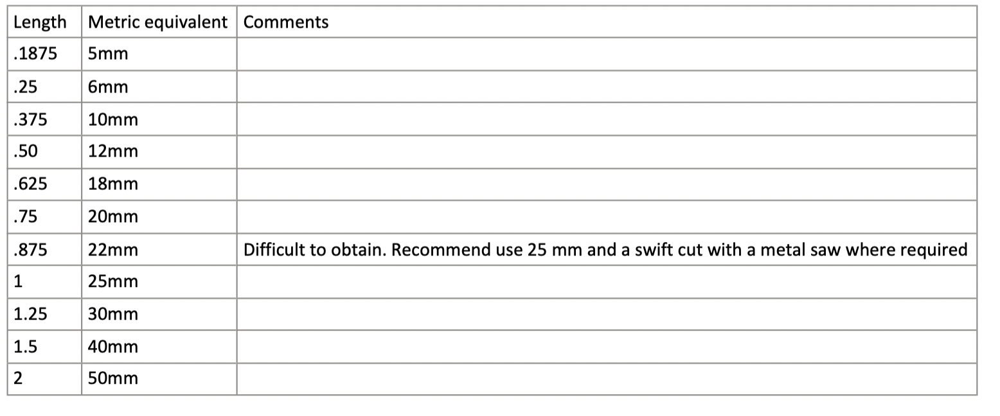
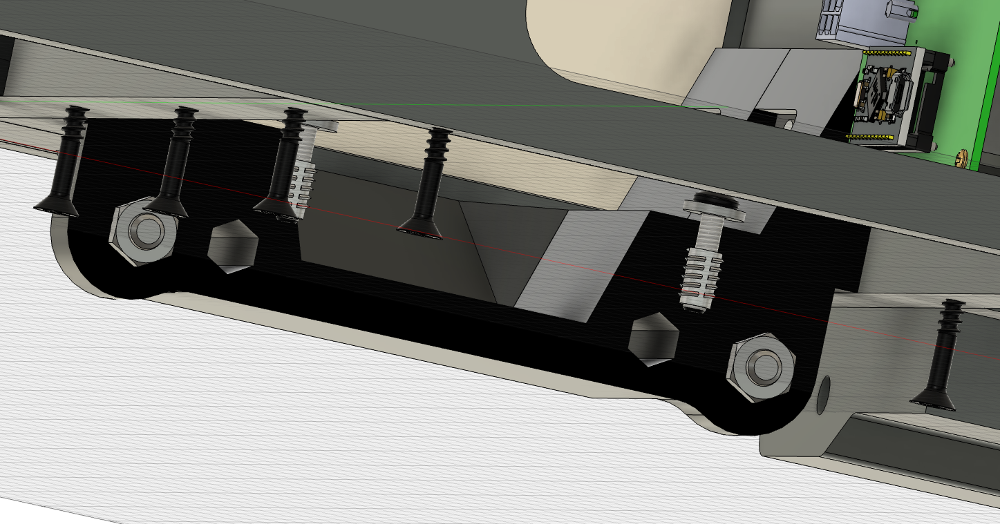

# Introduction

As the title in [my build log says](https://discord.com/channels/392833351238811648/1278055599082442907), my build is a metric one. I'll write down some "metric musings" with tips / considerations for metric builders. 

# Structure

The OH structure is specified in MDF and the thickness of the required materials is usually .75 or .5 inches. In metric regions (EU in my case), we usually don't have these thicknesses readily available. For example, hardware stores will usually have 19mm MDF or 18mm plywood as standard thicknesses; both of which isn't the exact specified value of .75 inches (19.05 mm). However, before ordering wood from overseas - check the tolerances! Usually the plywood and MDF tolerances range at +/- .8mm so if you order 19mm MDF, it could be up to 19.8mm thick anyway. In a nutshell: don't worry too much about the material thicknesses. Here are some basic transformations as discussed with @Breith :

|     Specified thickness      |     Exact conversion      |     What to use instead                                                                                                                  |
|------------------------------|---------------------------|------------------------------------------------------------------------------------------------------------------------------------------|
|  MFD                         |                           |                                                                                                                                          |
|     .75 MDF                  |     19.05 mm              |    18   mm   plywood or 19mm MDF*. In general, no adaptions of the structures needed, but this depends on your individual batch of wood. |
|     .5  MDF                  |     12.25 mm              |    12   mm   plywood or MDF                                                                                                              |
|     .25 MDF                  |      6.38 mm              |     6   mm   plywood or MDF                                                                                                              |
|  ACRL                        |                           |                                                                                                                                          |
|     .188 Lightplate          |     4.77  mm              |     5.0 mm  acrylic                                                                                                                      |
|     .127 Backplate           |     3.225 mm              |     3.0 mm  acrylic                                                                                                                      |
|     .125 Backplate           |     3.175 mm              |     3.0 mm  acrylic                                                                                                                      |
|  RMRK                        |                           |                                                                                                                                          |
|     .063 Rowmark             |     1.6   mm              |     1.5 mm  engraving material (CNC-plus.de or Innograv)                                                                                 |
|     .065 Rowmark             |     1.6   mm              |     1.5 mm  engraving material (CNC-plus.de or Innograv)                                                                                 |
|     .03                      |     0.762 mm              |     0.75mm                                                                                                                               |
|     .005                     |     0.127 mm              |     0.1 mm                                                                                                                               |

The script available in this folder automatically renames the files, but **this will not convert the internal dimensions of the svg files**. If your slicer or CNC software gives you weird dimensions, you have to fix it yourself.

To execute the script, you need to start PowerShell (`Windows key > powershell`), go in this directory and execute the script by typing `.\Convert_Name_To_Metric.ps1`.

# Fasteners

Here is my approach to convert the imperial-size fasteners used by the OH build plans to metric-sized fasteners. The key takeaway is that conversion is possible and straightforward, with little adaptions to the structure. In particular, where 3D printed brackets use hexagonal holes for hex nuts, I recommend adapting these holes to make sure the hex nut doesn't move. Other than that, almost no adaptions are really required.

# Screws

## Screw diameter and pitch

The Diameter is an important dimension (the first number) - Forget about the pitch. In the metric system, the pitch is standardized with the diameter and "baked in" I just made sure to get consistently "M" threads instead of "MF" threads. If you order metric fasteners at amazon, you will 99% likely get "M" threads.

*Conversion table for the screw diameter*

## Screw length
Not a too important dimension IMHO. Mostly I was able to get away with up to +/- 2mm in length. My suggestion is to obtain several large but cheap screw sets for every dimension (M3 box, M3.5 box, M4 box) with screws of different length and then just use what intuitively fits. 

*Conversion table for the screw legth*

## Head angle (in case of flat / pan head screws).

OH uses 82 degrees and 100 degrees. This conversion is the easiest one: in the metric system, all head angles are simply 90 degrees, just in the middle. If you manufacture your countersinks using a metric tool, it will be 90 degrees. Where you 3D print countersinks, you can probably get away without even adapting the countersunk hole. 

## DZUS 

Not implemented by me yet.

## Drive 

OH uses mostly standard Cross slot or simple slot screws. I recommend strongly going for either allen key heads (in case of panel screws) or Torx heads (for your wood screws), because their torque tolerance is much higher. In my case, my structure is made out of plywood, which is much more rigid and I simply destroyed all the cross slot screws I started out with and replaced them with Torx.

## Holes for fasteners

Only the 6-32 / M3.5 conversion is a tight fit. All other holes fit nicely. Us a washer in case of a loose fit. 

## Hex Nut holes

This is more important once again and probably the only spot where I carefully consider metric adaptions. The OH brackets use many "holes for hex nuts" and if I simply use the hex nut without adaptions, it may happen that the hex nuts turns in situ and I can't tighten the screw / nut combination. 

*I do not perform any adaptions here, because the hex nut could also be held in place with a plier until tight enough*

*For this black bracket, I definetely adapt the hole for the hex nut because it is inaccessible*

## End result

Here is my final conversion table as per part number. Contains most of the screws used in OH
[Conversions table](Metric Conversions 2.xlsx)